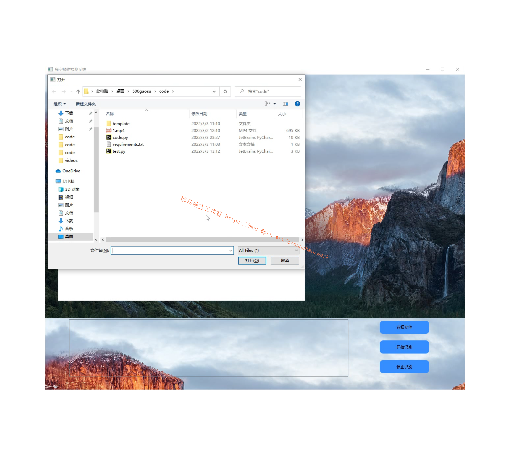

# **1.视频演示：**

[[项目分享]Python基于OpenCV高空抛物检测系统[完整源码＆部署教程]_哔哩哔哩_bilibili](https://www.bilibili.com/video/BV16Y4y1u7yL/?vd_source=bc9aec86d164b67a7004b996143742dc)


# **2.图片演示：**





# **3.算法原理：**
[参考该博客提出的移动侦测法](https://afdian.net/item?plan_id=34c97ad25f2511ed9b8e52540025c377)，即是根据视频每帧或者几帧之间像素的差异，对差异值设置阈值，筛选大于阈值的像素点，做掩模图即可选出视频中存在变化的桢。帧差法较为简单的视频中物体移动侦测，帧差法分为：单帧差、两桢差、和三桢差。随着帧数的增加是防止检测结果的重影。
#### [帧间差分法(Temporal Difference)](https://mbd.pub/o/bread/Y5WTm5Zx)
由于场景中的目标在运动，目标的影像在不同图像帧中的位置不同。该类算法对时间上连续的两帧或三帧图像进行差分运算，不同帧对应的像素点相减，判断灰度差的绝对值，当绝对值超过一定阈值时，即可判断为运动目标，从而实现目标的检测功能。

# **4.算法流程图：**


# **5.代码实现：**
```
def threh(video,save_video,thres1,area_threh):
 cam = cv2.VideoCapture(video)#打开一个视频
 input_fps = cam.get(cv2.CAP_PROP_FPS)
 ret_val, input_image = cam.read()
 index=[]
 images=[]
 images.append(input_image)
 video_length = int(cam.get(cv2.CAP_PROP_FRAME_COUNT))
 input_image=cv2.resize(input_image,(512,512))
 ending_frame = video_length
 fourcc = cv2.VideoWriter_fourcc(*'XVID')
 out = cv2.VideoWriter(save_video,fourcc, input_fps, (512, 512))
 gray_lwpCV = cv2.cvtColor(input_image, cv2.COLOR_BGR2GRAY)
 gray_lwpCV = cv2.GaussianBlur(gray_lwpCV, (21, 21), 0)
 background=gray_lwpCV

# es = cv2.getStructuringElement(cv2.MORPH_ELLIPSE, (9, 4))

 i = 0 # default is 0
 outt=[]
 while(cam.isOpened()) and ret_val == True and i <2999:
  ## if i % 2==1:
  ret_val, input_image = cam.read()
  input_image=cv2.resize(input_image,(512,512))
  gray_lwpCV = cv2.cvtColor(input_image, cv2.COLOR_BGR2GRAY)
  gray_lwpCV = cv2.GaussianBlur(gray_lwpCV, (21, 21), 0)
  diff = cv2.absdiff(background, gray_lwpCV)
  outt.append(diff)
  #跟着图像变换背景
  tem_diff=diff.flatten()
  tem_ds=pd.Series(tem_diff)
  tem_per=1-len(tem_ds[tem_ds==0])/len(tem_ds)
  if (tem_per <0.2 )| (tem_per>0.75):
   background=gray_lwpCV
  else:
   diff = cv2.threshold(diff, thres1, 255, cv2.THRESH_BINARY)[1]
   ret,thresh = cv2.threshold(diff.copy(),150,255,0)
   contours, hierarchy = cv2.findContours(thresh,cv2.RETR_EXTERNAL,cv2.CHAIN_APPROX_SIMPLE)
  #  contours, hierarchy = cv2.findContours(diff.copy(), cv2.RETR_EXTERNAL, cv2.CHAIN_APPROX_SIMPLE)
   for c in contours:
    if (cv2.contourArea(c) < area_threh) | (cv2.contourArea(c) >int(512*512*0.3) ) :  # 对于矩形区域，只显示大于给定阈值的轮廓（去除微小的变化等噪点）
     continue
    (x, y, w, h) = cv2.boundingRect(c) # 该函数计算矩形的边界框
    cv2.rectangle(input_image, (x, y), (x+w, y+h), (0, 255, 0), 2) 
    index.append(i)
  #  cv2.imshow('contours', input_image)
  #  cv2.imshow('dis', diff)
  out.write(input_image)
  images.append(input_image)
  i = i+1
 out.release()
 cam.release()
 return outt,index,images```
##调取函数
outt=threh('new_video.mp4','test6.mp4',25,3000)
```
# **6.系统整合：**
下图[完整源码&环境部署视频教程&自定义UI界面](https://s.xiaocichang.com/s/259db8)

参考博客[《Python基于OpenCV高空抛物检测系统\[完整源码＆部署教程\]》](https://mbd.pub/o/qunma/work)


# **7.参考文献：**
***
*   *[1]*[论AI技术在高空抛物中的应用及解决方案](https://kns.cnki.net/kcms/detail/detail.aspx?filename=AQFF202104006&dbcode=CJFD&dbname=CJFD2021&v=qdTGf1uARVbBpDj-ia2sd2zLSa3Qe6c1QcoVNovK6WKKA9YNpAAghNt30x-4ZdK-)[J]. 谢程晨,许言.  中国安全防范技术与应用. 2021(04)
*   *[2]*[一种端边云结合的高空抛物检测解决方案](https://kns.cnki.net/kcms/detail/detail.aspx?filename=AQFF202104007&dbcode=CJFD&dbname=CJFD2021&v=qdTGf1uARVbyOnFMsaBnZwDXJA2sMldzMQSWh6GDIiWLS_KMkh6-sNrV_OtmjvJ5)[J]. 王志芳,代翔.  中国安全防范技术与应用. 2021(04)
*   *[3]*[高空抛物监测系统关键技术及应用](https://kns.cnki.net/kcms/detail/detail.aspx?filename=AQFF202104008&dbcode=CJFD&dbname=CJFD2021&v=qdTGf1uARVZnWKpIwyRSkndUr2XHg3L2fw7oDoPpSB87XWBwM73OjAj-ElMa45qf)[J]. 王作文.  中国安全防范技术与应用. 2021(04)
*   *[4]*[高空抛物致人损害立法研究及启示](https://kns.cnki.net/kcms/detail/detail.aspx?filename=FBZX202202047&dbcode=CJFD&dbname=CJFD2022&v=Ez-82ugnJwirZfpeB3SSrNQRX8yXBOmrdQl9rkqfIJrlrOfhGLPZXfuF3JAgDDNr)[J]. 左中原.  法制博览. 2022(02)
*   *[5]*[《关于依法妥善审理高空抛物、坠物案件的意见》的理解与适用](https://kns.cnki.net/kcms/detail/detail.aspx?filename=RMSF202016006&dbcode=CJFD&dbname=CJFD2020&v=KuqujOYnG2iKkyTR6rAycl9N-d105k6zoF9JyiC4GCKtn2hatkIj2dvgLudrVxQk)[J]. 姜启波,郭锋,陈龙业.  人民司法. 2020(16)
*   *[6]*[高空抛物现象产生的原因及防御对策](https://kns.cnki.net/kcms/detail/detail.aspx?filename=FBZX202106079&dbcode=CJFD&dbname=CJFD2021&v=8ZjdVpFHgPTaaWOWGBxxLSOeZuV3abDbduffN9AMoPGHYCtukGZvD29ASIWqGP-6)[J]. 任玉梅.  法制博览. 2021(06)
*   *[7]*[合力保护“头顶上的安全”——浅谈高空抛物坠物的反思](https://kns.cnki.net/kcms/detail/detail.aspx?filename=FBZX202107073&dbcode=CJFD&dbname=CJFD2021&v=8ZjdVpFHgPQbJDrqiWF1s-NPIQceZm_rPGsikaQDz8H5jgGsqBQ_N4SS2aOOUWaz)[J]. 李洛锋,叶政琴,谢玉婷.  法制博览. 2021(07)
*   *[8]*[高空抛物治理不妨多管齐下](https://kns.cnki.net/kcms/detail/detail.aspx?filename=ZYAQ202103004&dbcode=CJFD&dbname=CJFD2021&v=tSGaXLz0BXTPDdMAB_4zbiNwXO_xLVjtJCDtunxXD46PdLXG0FZ57-GAJSzDI2bS)[J]. 刘言.  现代职业安全. 2021(03)
*   *[9]*[法律中高空抛物坠物行为的责任承担](https://kns.cnki.net/kcms/detail/detail.aspx?filename=FBZX202113054&dbcode=CJFD&dbname=CJFD2021&v=8ZjdVpFHgPSBGcmZ8eF-KgLrmjpXgq7V-PnX25hFO2pmPBbtiGA1GkDRJQp_6siJ)[J]. 刘丽霞.  法制博览. 2021(13)
*   *[10]*[高空抛物的多维度理解](https://kns.cnki.net/kcms/detail/detail.aspx?filename=FBZX202115038&dbcode=CJFD&dbname=CJFD2021&v=8ZjdVpFHgPS7EkHJUkoR2vmcuI_Sz3Qsi8aiZljcrPlLtmx230PmJzPpr4vFSnxl)[J]. 刘春松.  法制博览. 2021(15)


---
#### 如果您需要更详细的【源码和环境部署教程】，除了通过【系统整合】小节的链接获取之外，还可以通过邮箱以下途径获取:
#### 1.请先在GitHub上为该项目点赞（Star），编辑一封邮件，附上点赞的截图、项目的中文描述概述（About）以及您的用途需求，发送到我们的邮箱
#### sharecode@yeah.net
#### 2.我们收到邮件后会定期根据邮件的接收顺序将【完整源码和环境部署教程】发送到您的邮箱。
#### 【免责声明】本文来源于用户投稿，如果侵犯任何第三方的合法权益，可通过邮箱联系删除。